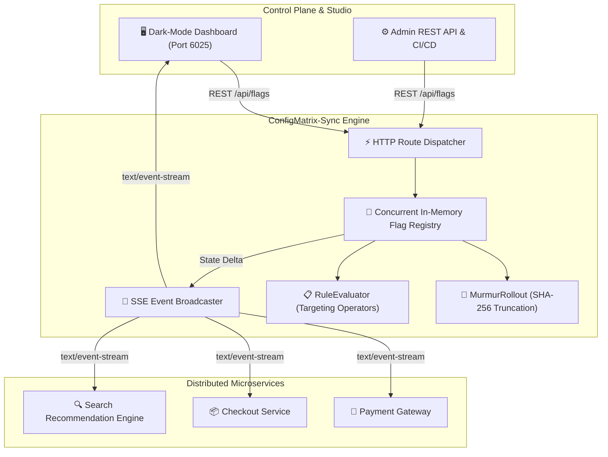

# ⚡ ConfigMatrix-Sync
> **Distributed Feature Flag & Dynamic Configuration Matrix with Deterministic Canary Rollouts**  
> *Developed autonomously by the 7-Agent SDLC Software Factory for [Ali Nurettin Demir](https://github.com/alinurettin)*

[]()
[-success.svg)]()
[]()
[]()
[](https://opensource.org/licenses/MIT)

---

## 🌟 Executive Summary & Value Proposition
In modern distributed microservice architectures, changing application behavior or launching feature experiments should not require a code commit, a continuous integration pipeline run, or a service restart.

**ConfigMatrix-Sync** is a high-speed, zero-dependency distributed feature flag and dynamic configuration control plane. Engineered from first principles using pure Node.js standard libraries, it delivers deterministic canary user bucketing via SHA-256 32-bit truncation hashing, complex multi-attribute targeting rules, and sub-10ms real-time event distribution over Server-Sent Events (SSE).

---

## 🏗️ System Architecture & Data Flow



---

## 🔬 Mathematical & Algorithmic Foundation

### 1. Deterministic Canary Rollout Hashing
To ensure that user $u$ receives the exact same evaluation outcome for flag $k$ across all distributed cluster nodes without maintaining state or distributed locks:

$$\text{digest} = \text{SHA-256}(u \mathbin{\Vert} \text{":\!"} \mathbin{\Vert} k)$$
$$\text{val}_{32} = \text{to\_uint32}(\text{digest}[0..3])$$
$$\text{bucket}(u, k) = \left\lfloor \frac{\text{val}_{32}}{2^{32} - 1} \times 100 \right\rfloor$$

A user is assigned to the canary cohort if $\text{bucket}(u, k) < P_{\text{rollout}}$.

### 2. Multi-Attribute Targeting Rule Evaluator
Each flag supports targeting rules evaluated in sequential order:
- **`equals` / `not_equals`**: Exact value equivalence.
- **`in` / `not_in`**: Set membership check.
- **`contains`**: Substring matching (e.g., `@company.internal`).
- **`greater_than` / `less_than`**: Numeric threshold comparison.
- **`regex`**: Regular expression validation.

If any rule matches, its `serve` value is immediately returned. If no rules match, evaluation falls back to the deterministic canary rollout percentage.

---

## 🔌 API Specification & Endpoints

| Method | Endpoint | Description |
|---|---|---|
| `GET` | `/api/health` | Service health status and uptime |
| `GET` | `/api/stats` | Registry metrics and active subscriber counts |
| `GET` | `/api/flags` | Retrieve all registered feature flags |
| `POST` | `/api/flags` | Register a new feature flag |
| `PUT` | `/api/flags/:key` | Update flag status, rollout, or description |
| `POST` | `/api/flags/:key/rollout` | Update canary rollout percentage ($0\text{--}100\%$) |
| `DELETE` | `/api/flags/:key` | Delete a flag from the matrix |
| `POST` | `/api/flags/evaluate` | Batch evaluate a user context against all flags |
| `POST` | `/api/flags/reset` | Reset matrix to baseline configuration |
| `GET` | `/api/events/stream` | Server-Sent Events (SSE) live delta stream |

### Context Evaluation Example
```bash
curl -X POST http://localhost:6025/api/flags/evaluate \
  -H "Content-Type: application/json" \
  -d '{
    "context": {
      "userId": "usr_alice_8492",
      "role": "admin",
      "email": "alice@company.internal",
      "country": "US"
    }
  }'
```

---

## 🧪 Comprehensive Automated Testing & Verification
The test suite in `tests/run_tests.js` runs without external mocking libraries:

```bash
node tests/run_tests.js
```

### Verified Test Categories:
- **Deterministic Canary Bucketing (8 assertions):** Verifies mathematical bounds ($[0, 99]$), deterministic repeatability, monotonic inclusion, and key independence.
- **Multi-Attribute Rule Evaluator (6 assertions):** Verifies `equals`, `contains`, `in`, `regex`, and fallback mechanics.
- **ConfigMatrixEngine Core (6 assertions):** Validates CRUD operations, duplicate key rejections, and state snapshots.
- **Live HTTP REST & SSE Integration (8 assertions):** Boots an ephemeral server on port 0, verifies status codes, JSON serialization, and error handling.

---

## 🚀 Getting Started

### Local Node.js Execution
```bash
# 1. Clone repository
git clone https://github.com/alinurettin/ConfigMatrix-Sync.git
cd ConfigMatrix-Sync

# 2. Run automated test suite
npm test

# 3. Start engine
npm start
```
Open **`http://localhost:6025`** in your browser to access the live dashboard.

### Docker & Docker Compose
```bash
docker-compose up -d --build
```

---

## 📄 Artifacts & Documentation
- [Research Report](file:///C:/Users/alinurettin/.gemini/antigravity/scratch/projects/ConfigMatrix-Sync/artifacts/RESEARCH_REPORT.md)
- [Product Requirements Document (PRD)](file:///C:/Users/alinurettin/.gemini/antigravity/scratch/projects/ConfigMatrix-Sync/artifacts/PRD.md)
- [Architecture Blueprint](file:///C:/Users/alinurettin/.gemini/antigravity/scratch/projects/ConfigMatrix-Sync/artifacts/ARCHITECTURE.md)
- [QA & Verification Report](file:///C:/Users/alinurettin/.gemini/antigravity/scratch/projects/ConfigMatrix-Sync/artifacts/QA_REPORT.md)
- [Release Notes](file:///C:/Users/alinurettin/.gemini/antigravity/scratch/projects/ConfigMatrix-Sync/artifacts/RELEASE_NOTES.md)

---

## 📜 License
MIT License. Engineered autonomously by the 7-Agent SDLC Software Factory for Ali Nurettin Demir.
