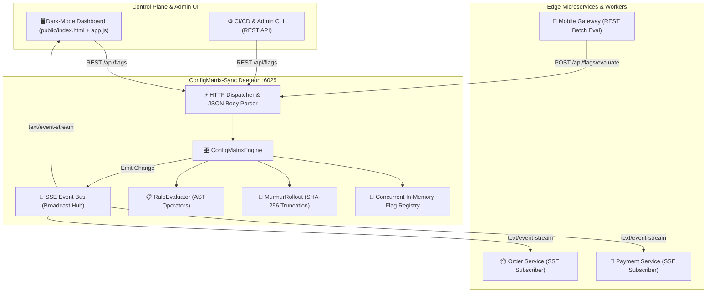

# 🏛️ Technical Architecture Document: ConfigMatrix-Sync
**Version:** 2.0.0  
**Domain:** Dynamic Configuration & Canary Deployment Engine  
**Architect:** 7-Agent SDLC Principal Software Architect  

---

## 1. System Architecture



---

## 2. Component Design & Responsibilities

### 2.1 `ConfigMatrixEngine` (`src/engine.js`)
- Primary state coordinator.
- Manages flag registration, updates, deletions, and snapshot state.
- Emits events (`flag_created`, `flag_updated`, `flag_deleted`, `matrix_reset`) to registered listener callbacks.

### 2.2 `MurmurRollout` (`src/engine.js`)
- Computes uniform deterministic bucket assignments in range $[0, 99]$.
- Combines identifier and flag key with separator: `user_id + ':' + flag_key`.
- Converts first 4 bytes of SHA-256 hash to unsigned 32-bit integer:
  $$\text{bucket} = \left\lfloor \frac{\text{val}_{32}}{2^{32} - 1} \times 100 \right\rfloor$$
- Monotonic guarantee ensures canary cohorts remain stable as rollout percentage increments.

### 2.3 `RuleEvaluator` (`src/engine.js`)
- Evaluates targeting conditions against arbitrary user context objects.
- Supported operators:
  - `equals` / `not_equals`: Exact string / number equivalence.
  - `in` / `not_in`: Set membership.
  - `contains`: Substring inclusion.
  - `greater_than` / `less_than`: Numeric comparison.
  - `regex`: Pattern matching with safe evaluation.

### 2.4 Server-Sent Events Gateway (`src/index.js`)
- Exposes `GET /api/events/stream` with `Content-Type: text/event-stream`.
- Sends initial snapshot of all registered flags upon connection.
- Streams live deltas whenever flags are modified or toggled.
- Auto-prunes disconnected client sockets on `close`.

---

## 3. Data Schema

### Flag Definition
```json
{
  "key": "dynamic_checkout_flow",
  "description": "Next-gen multi-step checkout pipeline",
  "enabled": true,
  "rolloutPercentage": 25,
  "defaultValue": false,
  "rules": [
    {
      "id": "rule_internal_testers",
      "attribute": "email",
      "operator": "contains",
      "value": "@company.internal",
      "serve": true
    },
    {
      "id": "rule_admin_bypass",
      "attribute": "role",
      "operator": "equals",
      "value": "admin",
      "serve": true
    }
  ],
  "createdAt": 1774160000000,
  "updatedAt": 1774160000000
}
```
